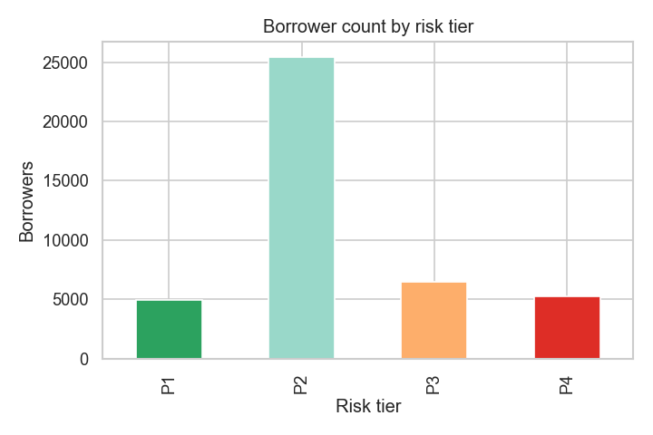
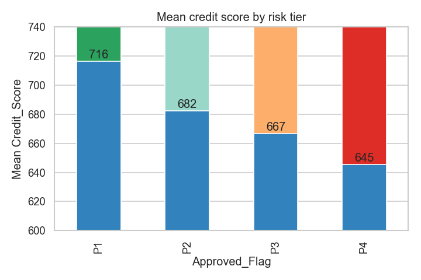
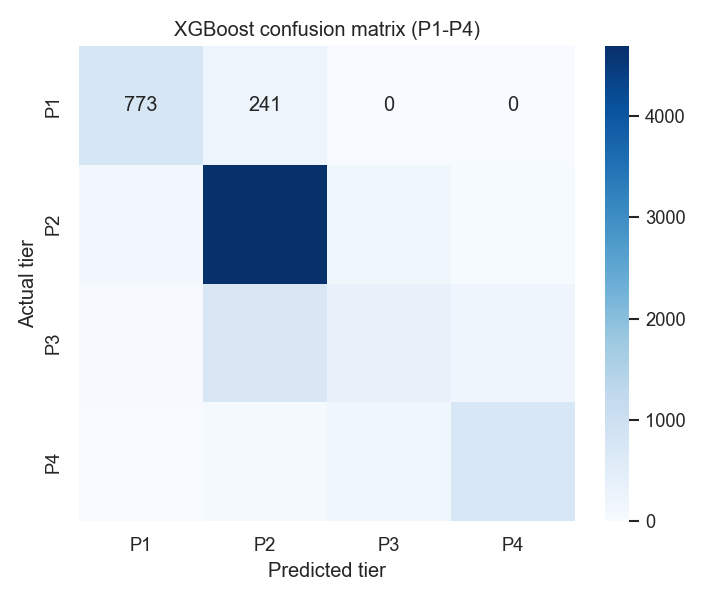
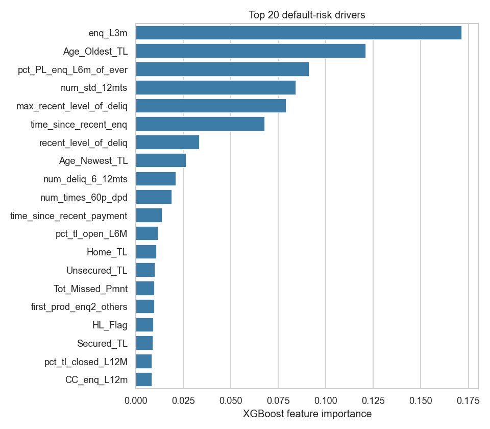

# Credit Risk Modeling & Borrower Segmentation

An end-to-end machine-learning pipeline that assesses credit risk across **42,064 borrowers** by
synthesizing **trade-line** and **credit-bureau** data, classifies each borrower into a
**four-tier risk segment (P1–P4)**, and translates that segment into a concrete underwriting
recommendation. XGBoost reaches a **~78% accuracy** baseline for scalable, data-driven loan-approval decisions.

---

## Business problem

Lenders must decide *who* to approve and *on what terms*. Each borrower carries a priority tier
derived from repayment behaviour (Days-Past-Due history and account standing):

| Tier | Meaning | Mean credit score | Underwriting recommendation |
|------|---------|------------------:|------------------------------|
| **P1** | Lowest risk | 716 | **Auto-approve** — best pricing, highest limit |
| **P2** | Low-to-moderate risk | 683 | **Approve** — standard terms |
| **P3** | Elevated risk | 667 | **Manual review** — risk-based pricing / reduced limit / collateral |
| **P4** | High risk | 646 | **Decline / escalate** — secured exception only |

Two data sources are integrated on `PROSPECTID`:
- **Trade-line data** (`case_study1`, 26 cols) — the lender's own account-level records (trade-line counts/age, missed payments, secured vs unsecured mix).
- **Bureau (CIBIL) + demographic data** (`case_study2`, 62 cols) — delinquency counts, credit inquiries, income, education, and the `Approved_Flag` target.

The portfolio is dominated by P2 borrowers (~60%), and mean credit score declines monotonically
from P1 to P4 — confirming the tiers form a coherent risk ordering rather than arbitrary labels.

| Borrower count by tier | Mean credit score by tier |
|---|---|
|  |  |

---

## Methodology

1. **Data preparation** (`src/data_prep.py`) — drop the `-99999` missing sentinel, remove 8 mostly-empty
   bureau columns, drop remaining sentinel rows, then inner-merge trade-line + bureau data →
   a clean **42,064-borrower, 0-null** modeling table (examined **77 raw indicators**).
2. **Feature selection** (`src/feature_selection.py`):
   - **Chi-Square** test of independence for categorical features (all 5 significant, p < 0.05).
   - **Variance Inflation Factor (VIF ≤ 6)** to remove multicollinear numeric features.
   - **One-way ANOVA (p ≤ 0.05)** to keep numeric features that separate the P1–P4 tiers.
   - Result: **42 selected features** → **54-column** model matrix after encoding.
3. **Encoding & scaling** (`src/train.py`) — ordinal encoding for `EDUCATION`, one-hot for the other
   categoricals, standard-scaling for wide-range numerics.
4. **Modeling & benchmarking** — Random Forest vs a grid-tuned XGBoost
   (`learning_rate=0.2, max_depth=3, n_estimators=200`), 80/20 split.
5. **Segmentation** (`src/segmentation.py`) — map the predicted tier to a lending decision.

### Results

| Model | Test accuracy |
|-------|--------------:|
| Random Forest | 76.3% |
| **XGBoost (tuned)** | **78.0%** |

> The portfolio is imbalanced (P2 ≈ 60%), so per-class recall is reported in
> `reports/classification_report.txt`. SMOTE was considered to rebalance the minority tiers;
> the figures above are the honest baseline **without** resampling.

The confusion matrix shows the model is strongest on the high-volume P2 tier and on the
high-risk P4 tier, with most confusion concentrated in the adjacent P2/P3 boundary:

<p align="center">
  
</p>

### Primary default-risk drivers

XGBoost feature importance is led by:
- **Inquiry behaviour** — `enq_L3m`, `pct_PL_enq_L6m_of_ever`, `time_since_recent_enq`
- **Delinquency history** — `max_recent_level_of_deliq`, `num_deliq_6_12mts`, `num_times_60p_dpd`, `Tot_Missed_Pmnt`
- **Credit history & trade-line mix** — `Age_Oldest_TL`, `num_std_12mts`, secured/unsecured balances

<p align="center">
  
</p>

---

## Project structure

```
Credit Risk Modeling & Borrower Segmentation/
├── data/                      # case_study1.xlsx (trade-line) + case_study2.xlsx (bureau)
├── src/
│   ├── config.py              # paths, thresholds, EDUCATION map, P1–P4 recommendation policy
│   ├── data_prep.py           # load + clean + merge  (self-checks 42,064 rows)
│   ├── feature_selection.py   # Chi-Square, VIF, ANOVA
│   ├── train.py               # encode, train RF + XGBoost, save model + metrics + figures
│   ├── segmentation.py        # tier → underwriting recommendation
│   └── predict.py             # score borrowers → tier + recommendation
├── notebooks/
│   └── credit_risk_modeling.ipynb   # narrated end-to-end walkthrough
├── models/xgb_credit_model.joblib   # trained model bundle (generated)
└── reports/
    ├── metrics.json                 # accuracy + top drivers (generated)
    ├── classification_report.txt    # per-class precision/recall (generated)
    └── figures/                     # EDA charts, confusion matrix, feature importance (generated)
```

---

## How to run

```bash
pip install -r requirements.txt

# 1. Verify the cleaned dataset (asserts 42,064 rows, 0 nulls)
python -m src.data_prep

# 2. Train + benchmark + save model, metrics, and figures
python -m src.train

# 3. Score sample borrowers → predicted tier + recommendation
python -m src.predict
```

Or open `notebooks/credit_risk_modeling.ipynb` for the full narrated analysis with charts.

---

## Author:
Anjali Yadav, (IIT Madras)

---

*Built on the CampusX Credit Risk Modeling case-study dataset. Tree-based ensemble classification on
structured trade-line and bureau data, with statistical feature selection and a business-facing
segmentation layer.*
